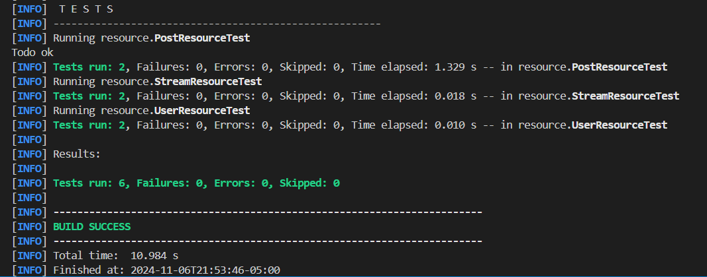
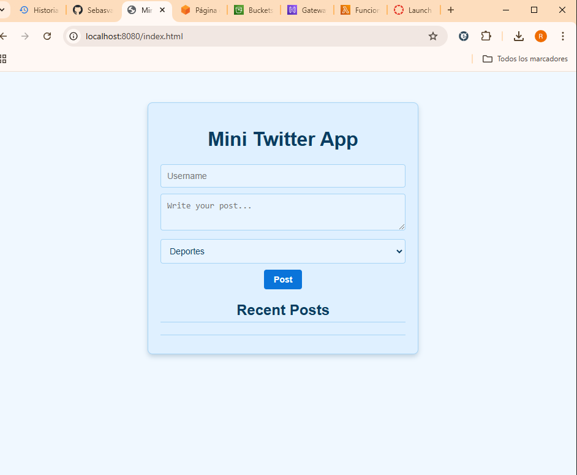
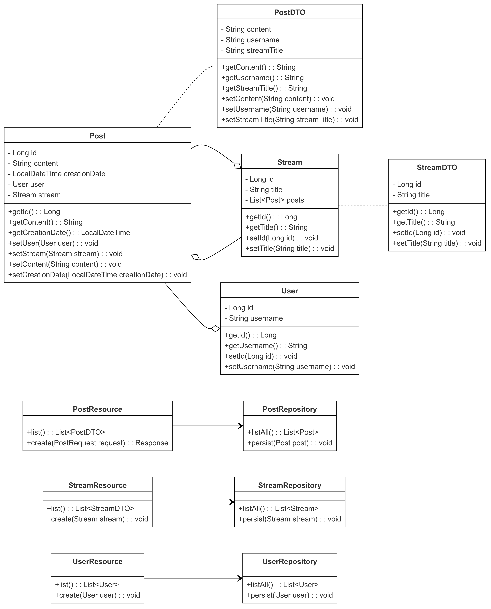
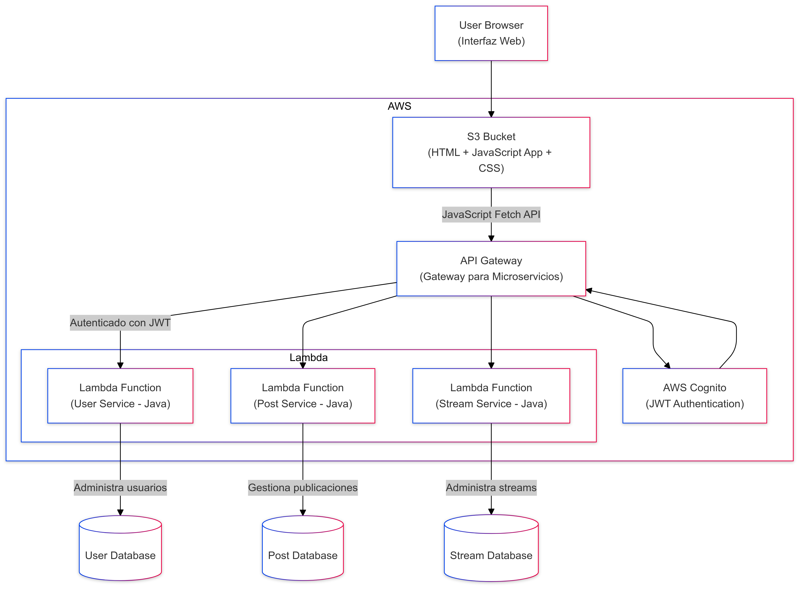
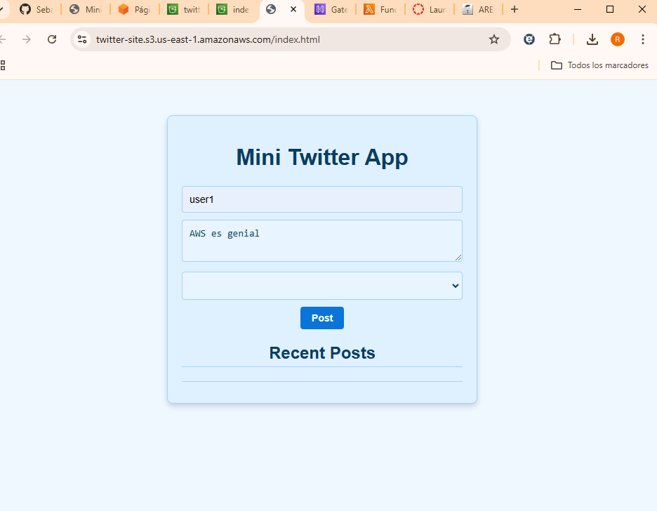
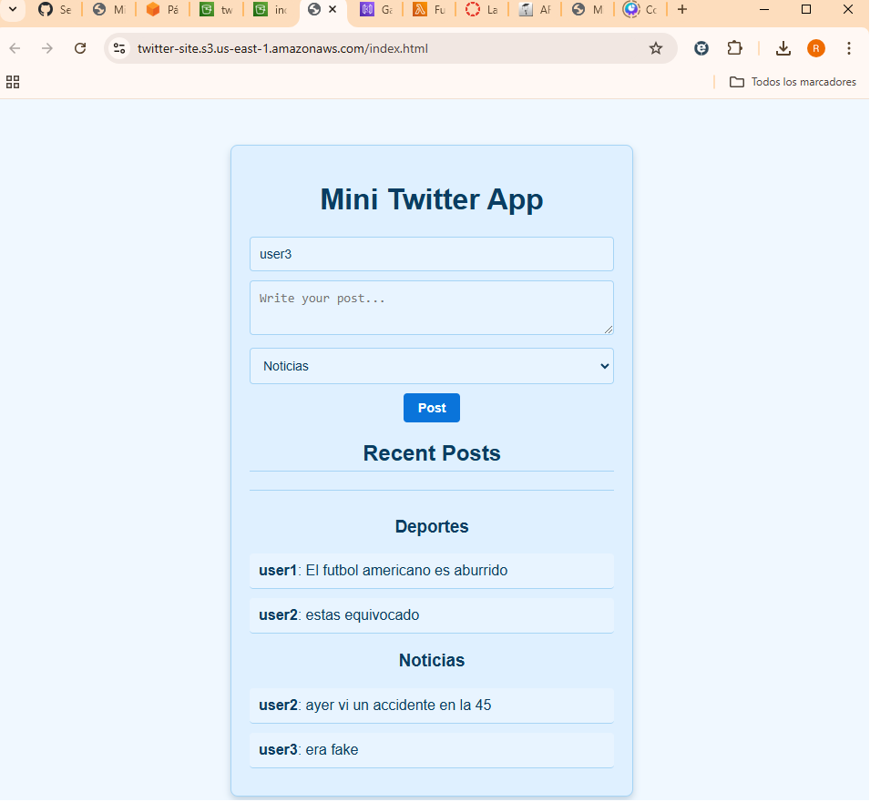

# MINI-TWITTER


This "Mini Twitter" application is a REST API developed in Java using Quarkus, allowing users to create posts of up to 140 characters and associate them with thematic "threads" or "streams." It includes entities such as User, Post, and Stream, managed through JPA and Panache repositories. The API exposes endpoints for creating and listing users, posts, and streams, while a simple HTML interface allows interaction with the application, enabling users to create and view posts grouped by thread. JavaScript is used to handle data loading and submission operations, providing an intuitive and visually pleasant experience for users.


## Getting Started

These instructions will get you a copy of the project up and running on your local machine for development and testing purposes.

### Prerequisites

You need to install the following tools and configure their dependencies:

1. **Java** (versions 21)
    ```sh
    java -version
    ```
    Should return something like:
    ```sh
    java version "21.0.2"
    Java(TM) SE Runtime Environment (build 21.0.2+13-LTS-58)
    Java HotSpot(TM) 64-Bit Server VM (build 21.0.2+13-LTS-58, mixed mode, sharing)
    ```

2. **Maven**
    - Download Maven from [here](http://maven.apache.org/download.html)
    - Follow the installation instructions [here](http://maven.apache.org/download.html#Installation)

    Verify the installation:
    ```sh
    mvn -version
    ```
    Should return something like:
    ```sh
    Apache Maven 3.2.5 (12a6b3acb947671f09b81f49094c53f426d8cea1; 2014-12-14T12:29:23-05:00)
    Maven home: /Users/dnielben/Applications/apache-maven-3.2.5
    Java version: 1.8.0, vendor: Oracle Corporation
    Java home: /Library/Java/JavaVirtualMachines/jdk1.8.0.jdk/Contents/Home/jre
    Default locale: es_ES, platform encoding: UTF-8
    OS name: "mac os x", version: "10.10.1", arch: "x86_64", family: "mac"
    ```

3. **Git**
    - Install Git by following the instructions [here](http://git-scm.com/book/en/v2/Getting-Started-Installing-Git)

    Verify the installation:
    ```sh
    git --version
    ```
    Should return something like:
    ```sh
    git version 2.2.1
    ```

### Installing

1. Clone the repository and navigate into the project directory:
    ```sh
    git clone https://github.com/Sebasvasquezz/Mini-Twitter-MicroServices.git 
    cd Mini-twitter-microservices
    ```

2. Build the backend:
    ```sh
    mvn clean package
    ```
## Testing the Application

The resources in this project (`UserResource`, `StreamResource`, and `PostResource`) are tested using JUnit and Mockito. Each resource has specific tests to verify that they function as expected. Below is a description of the tests for each resource.

### UserResource Tests

The `UserResource` class has two endpoints:
1. `GET /usuarios`: Lists all users.
2. `POST /usuarios`: Creates a new user.

#### Test Cases
- **testListUsers**: This test verifies that the `list()` method returns a list of users. We mock the `UserRepository` to return a predefined list of users and check that the returned list matches the expected data.
- **testCreateUser**: This test verifies that the `create()` method correctly persists a user. We create a mock user and call `create()`. We then use `verify` to ensure that `persist()` is called with the correct user.

### StreamResource Tests

The `StreamResource` class has two endpoints:
1. `GET /streams`: Lists all streams.
2. `POST /streams`: Creates a new stream.

#### Test Cases
- **testListStreams**: This test checks that the `list()` method returns a list of streams. The `StreamRepository` is mocked to return a predefined list of streams, and the test checks if the returned list matches the expected data.
- **testCreateStream**: This test verifies that the `create()` method correctly persists a stream. We create a mock stream and call `create()`. Using `verify`, we check that `persist()` was called with the correct stream.

### PostResource Tests

The `PostResource` class has two endpoints:
1. `GET /posts`: Lists all posts.
2. `POST /posts`: Creates a new post with user and stream association.

#### Test Cases
- **testListPosts**: This test verifies that the `list()` method returns a list of posts with the correct data. We mock `PostRepository` to return a list of predefined posts, and the test ensures that the returned data matches the expected values.
- **testCreatePost_Success**: This test checks that the `create()` method correctly associates a post with a user and stream, and then persists it. Mock data is used for `UserRepository` and `StreamRepository` to find existing users and streams, and `PostRepository` is used to verify persistence.

### Running Tests

To run all tests, use the following command:

```bash
mvn test
```

And you should get:



### Running the Application

1. **Run the backend:**
    ```sh
    mvn quarkus:dev
    ```

    The backend will start on `http://localhost:8080/index.html`, 

    

## Class Diagram


## Class Diagram Description

This class diagram represents the structure and relationships between the main entities, DTOs, repositories, and resources in the project.

### Entities

- **Post**: Represents a social media post in the application, with fields for content, creation date, a reference to the `User` who created the post, and an optional `Stream` to which the post belongs.
- **User**: Represents a user in the application, identified by a unique `username`.
- **Stream**: Represents a thread or topic to which posts can belong. Each stream has a unique title and a list of associated posts.

### Data Transfer Objects (DTOs)

- **PostDTO**: Simplified representation of a `Post` used for data transfer. Includes content, the username of the post creator, and the title of the stream (if applicable).
- **StreamDTO**: Simplified representation of a `Stream`, containing the stream's ID and title.

### Repositories

Each entity has a corresponding repository to manage database operations:

- **PostRepository**: Manages CRUD operations for `Post` entities.
- **UserRepository**: Manages CRUD operations for `User` entities.
- **StreamRepository**: Manages CRUD operations for `Stream` entities.

### Resources

RESTful resources provide endpoints to access and manipulate each entity:

- **PostResource**: Provides endpoints to retrieve all posts and create new ones. Uses `PostDTO` to transfer post data.
- **StreamResource**: Provides endpoints to list all streams and create new ones, using `StreamDTO`.
- **UserResource**: Provides endpoints to list all users and create new ones.

### Relationships

- **Associations**:
  - `Post` references a `User` as the post creator.
  - `Post` may belong to a `Stream`, representing a thread or topic.
  - `Stream` maintains a list of associated posts.

- **Dependencies**:
  - Each `Resource` class depends on its respective repository for data management.
  - `DTO` classes (`PostDTO` and `StreamDTO`) are used to simplify the data structure sent to clients.

This structure allows for clear separation of responsibilities, with resources handling RESTful endpoints, repositories managing persistence, and DTOs providing a simplified data transfer format.

## Architectural Diagram



## Architectural Diagram Description

- **Frontend (JavaScript + HTML on S3)**: The web interface of the application, deployed on S3, communicates with the backend through the API Gateway using `fetch` in JavaScript. The interface allows users to create and view posts.

- **API Gateway**: Serves as the entry point, managing requests to the Lambda microservices. It also applies JWT authentication via AWS Cognito.

- **AWS Cognito**: Provides JWT authentication to secure calls to the microservices.

- **Lambda Microservices (Java)**: The services were split from the original monolith into three Lambda functions to manage users, posts, and streams independently.

- **Databases (Optional)**: Each Lambda service can connect to separate databases to store users, posts, and streams, maintaining the modularity of the application.


## Deployment on AWS

### Step 1: Frontend Configuration on S3
An S3 bucket was created and configured as public, disabling access block to allow internet access. Then, the static website hosting option was enabled in the bucket, specifying `index.html` as the starting file. HTML, CSS, and JavaScript files were uploaded to the bucket, and the bucket’s public URL was verified to function as the frontend address for the application.

### Step 2: Cognito Configuration for JWT Authentication
An AWS Cognito user pool was set up to handle user authentication via JWT. An application client was created within the user pool, allowing JWT tokens to be generated for frontend authentication. The user pool details and authentication endpoint were saved for use in configuring API Gateway and the frontend.

### Step 3: API Gateway Configuration
A REST API was configured in API Gateway, creating routes for the microservices (`/users`, `/posts`, `/streams`). Each route was integrated with the respective Lambda functions, allowing `GET` and `POST` methods as required. A Cognito authorizer was added to the API to ensure requests included a valid JWT. Finally, the API was deployed, and the base URL was obtained for frontend calls.

### Step 4: Lambda Functions Creation
Three Lambda functions were created in Java to handle `UserService`, `PostService`, and `StreamService`, each configured independently. The functions were deployed using Quarkus to manage the services and assigned the necessary permissions to interact with Cognito and other AWS resources. Each function was tested in Lambda’s test environment to verify functionality.

### Step 5: Database Configuration (Optional)
Databases were created in Amazon RDS to manage user, post, and stream information modularly. Then, connections were configured for each Lambda function to its respective database, ensuring access permissions were properly set.

### Step 6: Frontend and Backend Integration
In the frontend JavaScript code, the API call URLs were updated to point to the API Gateway endpoint. The application was also set up to include the Cognito JWT token in each API request, ensuring authentication was enabled for each interaction.

### Step 7: Testing and Verification
Finally, the full application flow was verified by accessing the S3 public URL, authenticating via Cognito, and creating posts to ensure each component worked correctly. CloudWatch monitoring tools were used to check Lambda logs and traffic in API Gateway, making performance and security adjustments as needed.

https://twitter-site.s3.us-east-1.amazonaws.com/index.html 






## Built With

* [Maven](https://maven.apache.org/) - Dependency Management for backend
* [Git](http://git-scm.com/) - Version Control System
* [Quarkus](https://quarkus.io/) - Java framework optimized for Kubernetes and serverless environments

## Versioning

I use [GitHub](https://github.com/) for versioning. For the versions available, see the [tags on this repository](https://github.com/Sebasvasquezz/Mini-Twitter-MicroServices.git).

## Authors

* **Alexandra Cortes Tovar** - [alexandrac1420](https://github.com/alexandrac1420)
* **Jose Ricardo Vasquez Vega** - [Richi025](https://github.com/Richi025)
* **Juan Sebastian Vasquez Vega** - [Sebasvasquezz](https://github.com/Sebasvasquezz)

## License

This project is licensed under the MIT License - see the [LICENSE.md](LICENSE.md) file for details.
